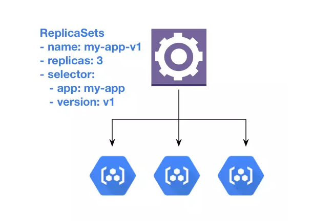
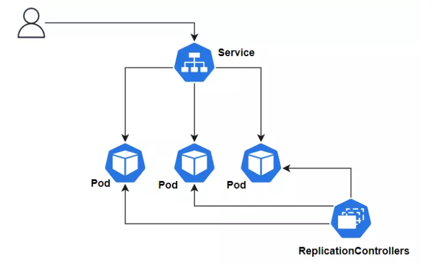
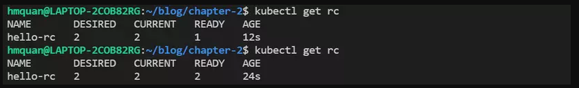
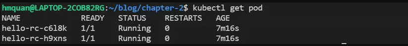
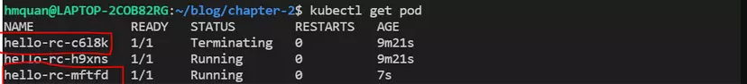

# Kubernetes Note 

### 1. Kiến trúc của Kubernetes
- Kubernetes cluster bao gồm 2 thành phần chính sau:
  + Master nodes
  + Worker notes
- Master node bao gồm 4 thành phần chính là : API Manager, Controller Manager, Scheduler và Etcd
  + Api Server : Thành phần chính giao tiếp với các thành phần khác
  + Controller Manager : gồm nhiều controller riêng cụ thể cho từng resource và thực hiện các chứng năng cụ thể cho từng thằng resource trong kube như create pod, create deployment
  + Scheduler: schedules ứng dụng tới node nào
  + Etcd: là một database để lưu giữ trạng thái và resource của cluster

### 2. Ví dụ tạo Pod
- Source code : [example_pod](/example_pod)
- Tạo file index.js
- Tạo file Dockerfile
- Tạo file hello-kube.yml
- Build images :
```shell
docker build -t 123497/hello-kube .
```
- Run chạy thử container từ images vừa build:
```shell
docker run -d --name hello-kube -p 3000:3000 123497/hello-kube
```
- Truy cập được vào localhost:3000 OK
- Push lên docker hub
```shell
docker push 123497/hello-kube
```
- Apply file tạo pod hello-kube.yml
```shell
kubectl apply -f hello-kube.yml
```
- Kiểm tra pod: 
```shell
kubectl get pod
```

### 3. Tự động tạo và quản lý pod : ReplicationControllers , ReplicaSets
- ReplicationControllers:
  + Là Một resource mà sẽ tạo và quản lý pod, đảm bảo số lượng pod luôn running
  + Bằng cách tạo ra số lượng pod bằng với giá trị chỉ định ở thuộc tính "replica", và quản lý thông qua labels của pod
    
  + Ta biết rằng Pod giám sát container và tự động restart lại container khi nó fail
  + Trong trường hợp toàn bộ worker node fail thì pod sẽ ko chạy nữa ?
  + Nếu chạy cluster với nhiều hơn 1 Worker node, Th ReplicationControllers sẽ giúp giải quyết vấn đề trên
  + Replication Controller nếu phát hiện ra số lượng pod của một worker_node nào đó = 0 -> Sẽ tạo một Pod ở worker node khác để
  + Ngoài ra, Replication Controller còn giúp tăng performance của ứng dụng bằng cách chỉ định số lượng replicas trong Replcation Controller để tạo ra nhiều pod chạy một ứng dụng
  + Ví dụ ta có một webservice, nếu ta chỉ deploy một pod để chạy ứng dụng, thì ta chỉ có 1 container để xử lý request của user, nhưng nếu ta dùng RC và chỉ định replicas = 3, ta sẽ có 3 pod chạy 3 container của ứng dụng, và request của user sẽ được gửi tới 1 trong 3 pod này, giúp quá trình xử lý của chúng ta tăng gấp 3 lần
    


#### 3.1. Ví dụ tạo ReplicationController
- Source code : [example_replication_controller](/example_replication_controller)
  - Kiến trúc của 1 Replication Controller gồm 3 thành phần chính sau:
    + label selector : chỉ định pod nào sẽ được RC giám sát
    ```dockerfile
    spec:
      replicas: 2
      selector:
        app: hello-kube
    ```

  + Replica count : Số lượng pod sẽ được tạo
    ```dockerfile
    spec:
    replicas: 2
    selector:
    app: hello-kube
    ```
    + Pod template : Config của pod sẽ được tạo
    ```dockerfile
    template:
      metadata:
        labels:
          app: hello-kube
      spec:
        containers:
          - image: 123497/hello-kube
            name: hello-kube
            ports:
              - containerPort: 3000
    ```
- Tạo Replication Controller bằng lệnh: `kubectl apply -f hello-rc.yaml`
- Kiểm tra xem đã tạo RC thành công chưa :` kubectl get rc`
  
  - Kiểm tra tình trạng pod: ` kubectl get pod`
    
- Khi xóa một pod thì Replication Controller sẽ tự động tạo một pod khác để đảm bảo số lượng replication = 2
  


#### 3.2. Ví dụ sử dụng Replica Sets
- Replica Sets là một resource tương tự Replication Controller nhưng nó là một phiên bản mới hơn của Replication Controller
- Tạo file ReplicaSet: hello-rs.yaml
```dockerfile

apiVersion: apps/v1
kind: ReplicaSet 
metadata:
  name: hello-rs
spec:
  replicas: 2
  selector:
    matchLabels: 
      app: hello-kube
  template:
    metadata:
      labels:
        app: hello-kube
    spec:
      containers:
      - image: 123497/hello-kube
        name: hello-kube
        ports:
          - containerPort: 3000
```

- Apply file replica-set : kubectl apply -f hello-rs.yaml


- So sánh ReplicaSets và ReplicationController
- RS và RC sẽ hoạt động tương tự nhau. Nhưng RS linh hoạt hơn ở phần label selector, trong khi label selector thằng RC chỉ có thể chọn pod mà hoàn toàn giống với label nó chỉ định, thì thằng RS sẽ cho phép dùng một số expressions hoặc matching để chọn pod nó quản lý.


### 4. Service trong k8s
- Mỗi Service có một IP và một port không đổi, trừ khi xóa service đi và tạo lại
- Client chỉ cần tương tác với endpoint là service
- Service có 4 loại cơ bản là :
  + Cluster IP
  + Node port
  + External name
  + Load Balancer


#### 4.1 Cluster IP
- Là 1 loại service mà sẽ tạo ra một IP và một local DNS mà có thể truy cập bên trong cluster (node), ko thể truy cập ra bên ngoài, được dùng chủ yếu cho các pod trong cluster giao tiếp với nhau
- **Source code** : [example_service/service_cluster_ip](/example_service/service_cluster_ip)


#####  4.1.1 Build images & push docker
- Tạo file index.js
- Tạo file Dockerfile
- Build images: `docker build -t 1234997/demo-redis`
- Push lên docker hub : `docker push 1234997/demo-redis:latest`

##### 4.1.2: Tạo pod redis & Service
- Tạo file redis-service.yaml

- Apply file redis-service.yaml : `kubectl apply -f redis-service.yaml`
- Kết quả : 
   + Pod: 
   + Service : 


#### 4.2 NodePort:
- Tương tự như Cluster IP là tạo endpoint để các container truy cập, ngoài ra nó sử dụng một port của toàn bộ worker node để client bên ngoài có thể truy cập vào.

